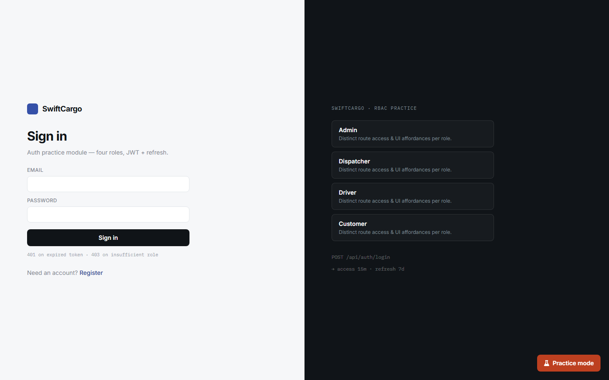

# AssertQuest

AssertQuest is a free, self-hostable platform for practicing automation testing
(API, DB, and UI) against a realistic enterprise application. It wraps
**SwiftCargo** — a logistics and freight management system — in challenges,
difficulty tiers, and a learning platform (`th-web`) with a challenge board,
leaderboard, and community features.



## Repo layout

This is an npm workspaces monorepo:

```
apps/
  api/       Fastify + Prisma API for SwiftCargo and AssertQuest
  web/       SwiftCargo web app (the practice target)
  th-web/    AssertQuest learning platform (challenges, leaderboard)
packages/
  shared/    Shared UI components, types, and utilities
docs/
  api/         Per-module API reference (auth, billing, booking, fleet, ...)
  challenges/  Challenge definitions per module
  self-host.md               Public self-hosting guide
  assertquest-requirements.md  Product requirements document
scripts/     DB and self-host mirror tooling
```

## Getting started

Requirements: Node.js, npm, and Docker (for Postgres).

```bash
npm install
npm run db:start      # start Postgres via Docker
npm run dev:api        # start the API (http://localhost:4000)
npm run dev:web        # start SwiftCargo web app (http://localhost:5173)
npm run dev:th-web      # start the AssertQuest platform (http://localhost:5174)
```

Or run everything containerized:

```bash
docker compose up
```

See [docs/self-host.md](docs/self-host.md) for demo accounts, environment
variables, and the public self-host mirror.

## Common scripts

| Command | Description |
|---|---|
| `npm run build` | Build shared package and all apps |
| `npm run test` | Run API tests |
| `npm run typecheck` | Typecheck all workspaces |
| `npm run lint` | Lint all workspaces |
| `npm run db:status` / `db:stop` | Manage the local Postgres container |
| `npm run db:psql` | Open a psql shell against the local DB |
| `npm run db:portal` | Open Prisma Studio |

## Documentation

- [docs/assertquest-requirements.md](docs/assertquest-requirements.md) — product requirements
- [docs/self-host.md](docs/self-host.md) — self-hosting guide
- [docs/api/](docs/api/) — API reference per module
- [docs/challenges/](docs/challenges/) — challenge definitions per module
